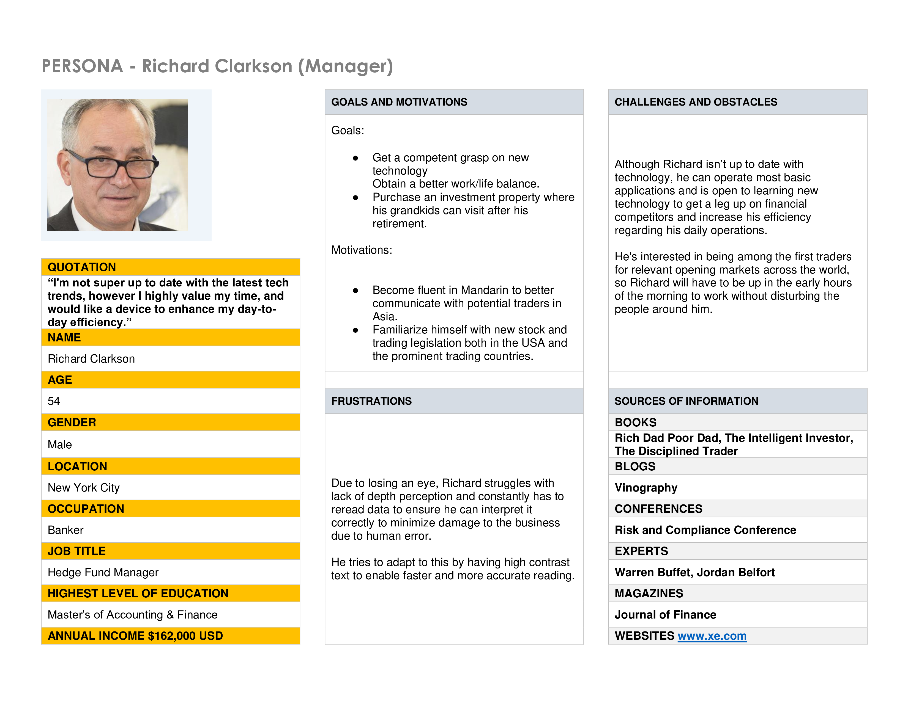
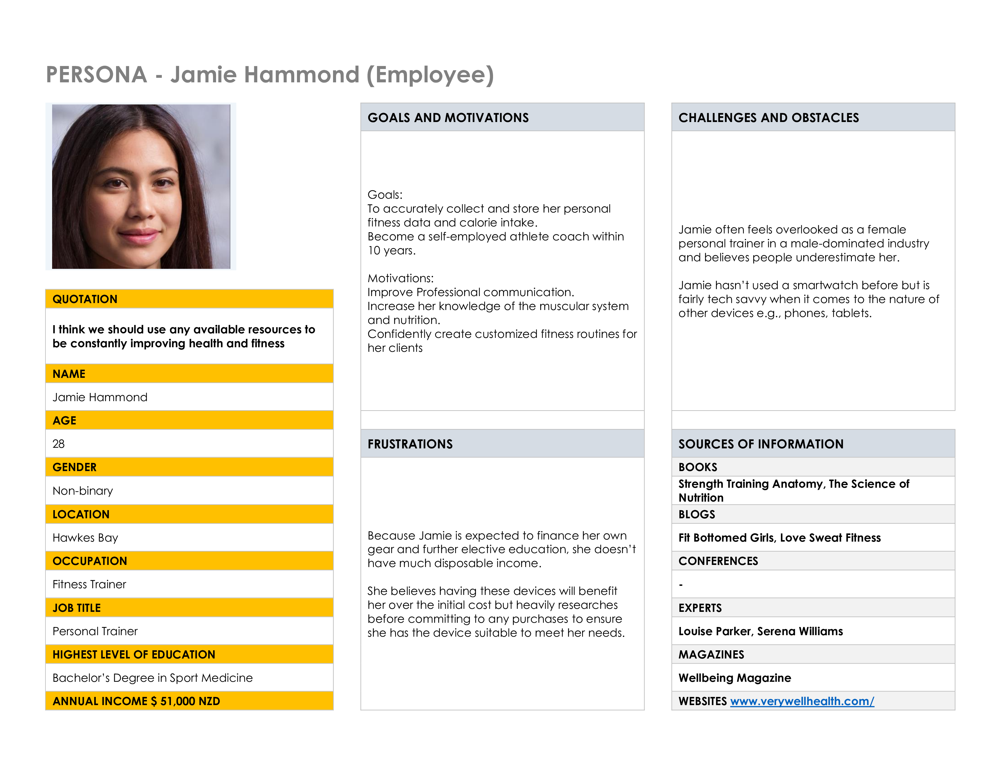

# Persona's for smartwatch e-commerce platform

---
## Persona 1

## Richard Clarkson

### Quote
>“I'm not super up to date with the latest tech trends, however I highly value my time, and would like a device to enhance my day-to-day efficiency.”

---

|     **Age**    |  **54** |
|------------|-------------------|
|   **Gender**     |  Male   |
|  **Location**  | New York City |
| **Occupation** | Banker |
| **Job Title**  | Hedge Fund Manager |
| **Highest level of education** | Master’s of Accounting & Finance |
| **Annual income** | $162,000 USD |

---

### Goals and motivations

#### Goals

* Get a competent grasp on new technology.

* Purchase an investment property where his grandkids can visit after his retirement.

#### Motivations

* Become fluent in Mandarin to better communicate with potential traders in Asia.

* Familiarize himself with new stock and trading legislation both in the USA and the prominent trading countries.

---
### Frustrations 

* Due to losing an eye, Richard struggles with lack of depth perception and constantly has to reread data to ensure he can interpret it correctly to minimize damage to the business due to human error.

---

### Challenges and Obstacles

* Although Richard isn’t up to date with technology, he can operate most basic applications and is open to learning new technology to get a leg up on financial competitors and increase his efficiency regarding his daily operations.

---

### Sources of information

| **Books** | **Rich Dad Poor Dad, The Intelligent Investor, The Disciplined Trader** |
|-------|----------|
| **Blogs** | Vinography |
| **Conferences** | Risk and Compliance Conference |
| **Experts** | Warren Buffet, Jordan Belfort |
| **Magazines** | Journal of Finance |
| **Websites** | businessinsider.com |

---
### Screenshot of Persona 1

---

## Persona 2

## Jamie Hammond 

### Quote
>“I think we should use any available resources to be constantly improving health and fitness.”

---

|     **Age**    |  **28** |
|------------|-------------------|
|   **Gender**     |  Non-binary   |
|  **Location**  | Hawkes Bay |
| **Occupation** | Fitness Trainer |
| **Job Title**  | Personal Trainer |
| **Highest level of education** | Bachelor’s Degree in Sport Medicine |
| **Annual income** | $51,000 NZD |

---

### Goals and motivations

#### Goals

* To accurately collect and store her personal fitness data and calorie intake.

* Become a self-employed athlete coach within 10 years.

#### Motivations

* Improve Professional communication.

* Increase her knowledge of the muscular system and nutrition.

* Confidently create customized fitness routines for her clients

---
### Frustrations 

* Because Jamie is expected to finance her own gear and further elective education, she doesn’t have much disposable income.

* She believes having these devices will benefit her over the initial cost but heavily researches before committing to any purchases to ensure she has the device suitable to meet her needs.

---

### Challenges and Obstacles

* Jamie often feels overlooked as a female personal trainer in a male-dominated industry and believes people underestimate her. 

* Jamie hasn’t used a smartwatch before but is fairly tech savvy when it comes to the nature of other devices e.g., phones, tablets.

---

### Sources of information

| **Books** | **Strength Training Anatomy, The Science of Nutrition** |
|-------|----------|
| **Blogs** | Fit Bottomed Girls, Love Sweat Fitness |
| **Conferences** | - |
| **Experts** | Louise Parker, Serena Williams |
| **Magazines** | Wellbeing Magazine |
| **Websites** | www.verywellhealth.com |

---
### Screenshot of Persona 2

---

## Persona 3

## Kelly Petrowski  

### Quote
>“If you always do what you’ve always done, you’ll always get what you’ve always got.”

---

|     **Age**    |  **24** |
|------------|-------------------|
|   **Gender**     |  Female  |
|  **Location**  | Palmerston North |
| **Occupation** | Student/Volunteer |
| **Job Title**  | RSPCA Volunteer |
| **Highest level of education** | NCEA Level 2 |
| **Annual income** | $25,000 NZD |

---

### Goals and motivations

#### Goals

* Secure a suitable job that aligns with her work culture needs after graduating

* Complete further study to qualify for exotic animal nursing.

* Purchase her first car.

#### Motivations

* To obtain good grades and excellent letters of recommendation from her professors to assist in further training opportunities.

* To be able to manage her time effectively to get the most out of both school and social events.

---
### Frustrations 

* Because Kelly has a student income, she has very low disposable and cannot afford most branded products or top of the line devices.

* Kelly also has ADHD and struggles to manage her time effectively between class, study, part time work and social engagements.

* Due to an accident Kelly has a medicine regime that needs to take priority. It can be slightly flexible but is generally unadaptable.

---

### Challenges and Obstacles

* Kelly is very tech savvy and can quickly pick up most devices and competently use them but gets easily distracted when operating any device. 

* She gets overwhelmed with too much noise and struggles to handle being in large crowds.

* Kelly is still studying so she has no real work experience and worries that it will be a struggle to get her career off the ground. 

* Kelly had extensive medical issues that disrupted her education plans. With hard work she hopes to regain control and get her education and career path back on track.

---

### Sources of information

| **Books** | **BSAVA Veterinary Nursing** |
|-------|----------|
| **Blogs** | RSPCA Newsletter |
| **Conferences** | - |
| **Experts** | Dr Chris Brown |
| **Magazines** | Pet Life Magazine |
| **Websites** | TikTok |

---
### Screenshot of Persona 3

---

